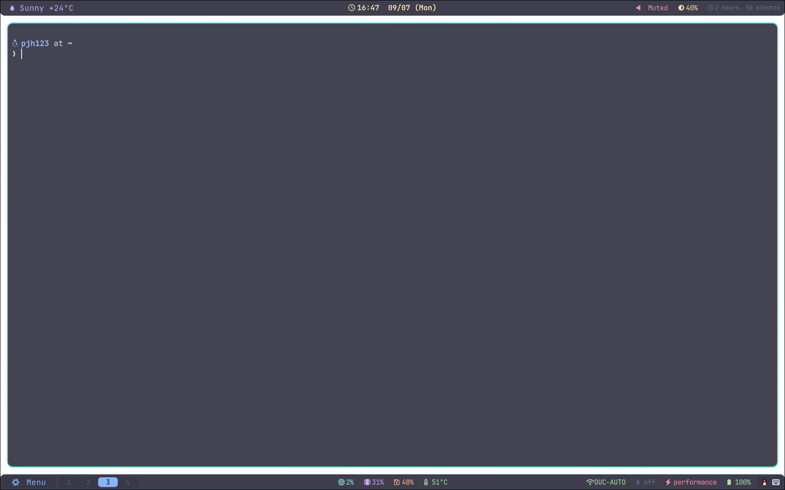

# Hyprland 配置（Dotfiles）

[English](../README.md) | 中文

我的个人 Arch dotfiles：带 systemd 用户服务管理的 Hyprland 配置，外加 shell 及部分编辑器周边配置。



## 架构

所有服务通过 `systemd --user` 管理：

- `hyprland-session.target` — 会话生命周期 target
- `hyprland.conf` 启动时执行 `exec-once = ~/.config/hypr/scripts/init.sh`
- `init.sh` 把 Wayland 环境变量导入 systemd，然后启动 `hyprland-session.target`
- 所有守护进程（`waybar`、`swaync`、`hyprpaper`、`hypridle`、`fcitx5-daemon`、`copyq`）通过 `BindsTo=` / `PartOf=` 绑定到该 target

蓝牙是**按需启动**以省电的：空闲时 `bluetooth.service` 和无线电都是关闭的。waybar 的 `bt-toggle` 自定义模块显示当前状态，点击它会启动 `bluetooth.service`（经由 `install.sh` 配置的免密 sudoers 规则）、打开适配器并启动 `blueman-manager`。不使用托盘小程序（`blueman-applet`）。

因此 Hyprland 退出时，所有服务会被自动清理。

## 安装

已在 Arch / CachyOS 和 Debian（testing）上验证。

```bash
git clone https://github.com/pjh456/dotfiles ~/dotfiles
~/dotfiles/install.sh --packages
```

不带参数时 `install.sh` 会：

- 把已存在的 dotfiles 备份到 `~/.dotfiles-backup-<时间戳>/`，然后以
  普通文件拷贝的方式把 `etc/` 里的全部内容放进 `$HOME`；
- 启用主程序已安装的会话服务（`systemctl --user`）；
- 写入按需蓝牙的 NOPASSWD sudoers 规则。

选项：

| 选项 | 作用 |
|---|---|
| `--packages` | 额外安装所需软件包——官方源走 `pacman`（Arch）或 `apt`（Debian），若检测到 `yay`/`paru`/`buttercup` 则 AUR 走它们；Debian 上改为打印需要手动编译的清单。清单位于 [`packages/`](../packages/)，由 CI 对着实时数据库校验。 |
| `--no-<pkg>` | 配合 `--packages` 使用：不安装软件包 `<pkg>`。包名必须存在于当前发行版的清单中，否则报错。 |
| `--restore [DIR]` | 回滚一次部署：删除已部署的文件（按 `~/.dotfiles-deployed` 清单），并从 `DIR` 还原备份的原始文件（默认：最新的 `~/.dotfiles-backup-*`）。systemd 启用和 sudoers 规则不会回滚。 |
| `--no-systemd` | 跳过 `daemon-reload` 和会话服务启用。 |
| `--no-sudo` | 跳过按需蓝牙的 sudoers 规则。 |
| `-h`, `--help` | 显示用法。 |

脚本是幂等的——重复运行安全。

首次运行前，确认以下 `pass` 条目已存在（`.bashrc` 在 shell 启动时读取）：
`snyk/token`、`huggingface/token`。

### Debian 说明

在 Debian 上，`--packages` 通过 `apt` 安装
[`packages/debian.txt`](../packages/debian.txt)，并打印需要手动编译的软件包。
Debian 稳定版（trixie）的 main 里还没有 hyprland——请用 testing，或 stable
加上 trixie-backports。两个细节：

- `tlp` 与 `power-profiles-daemon` 冲突。`power-mode` waybar 模块需要
  `net.hadess.PowerProfiles` D-Bus 接口，tlp 1.10 已内置该功能——在
  `/etc/tlp.conf` 里设置 `TLP_PD_ENABLE=1` 启用。
- Arch 的 `fcitx5-gtk` 在 Debian 上叫 `fcitx5-frontend-gtk3` /
  `fcitx5-frontend-gtk4`。

#### 手动编译（Debian）

以下没有 Debian 软件包，需从源码构建：

| 包名                        | 源码                                                        |
| -------------------------- | ----------------------------------------------------------- |
| hypridle                   | https://github.com/hyprwm/hypridle                            |
| hyprlock                    | https://github.com/hyprwm/hyprlock                            |
| hyprpaper                   | https://github.com/hyprwm/hyprpaper                           |
| hyprswitch                  | https://github.com/hyprwm/hyprswitch                          |
| swaync                      | https://github.com/elkowar/swaync                             |
| fonts-jetbrains-mono-nerd   | https://github.com/nerd-fonts/nerd-fonts（安装脚本）          |

然后启动 Hyprland：

```bash
start-hyprland
```

首次启动时，`init.sh` 会重启 `hyprland-session.target` 以载入所有服务；之后的启动只会拉起尚未运行的单个服务。

## 日常使用

仓库的 `etc/` 是唯一事实来源，`$HOME` 里是普通文件拷贝。修改配置时编辑
仓库里的文件，然后重跑 `~/dotfiles/install.sh` 应用——未变化的文件不动，
变化过的重新拷贝。直接改 `$HOME` 里的文件不会进仓库，想保留的话先拷回
`etc/` 再提交。

## 回滚

```bash
~/dotfiles/install.sh --restore            # 用最新备份
~/dotfiles/install.sh --restore <dir>      # 或指定 ~/.dotfiles-backup-*/
```

删除已部署的文件（按 `~/.dotfiles-deployed` 清单），并把备份的原始文件
还原。不会回滚的部分：systemd 服务启用、sudoers 规则。

## 快捷键

| 按键                   | 功能                                           |
| ---------------------- | ---------------------------------------------- |
| `Super + Return`      | 打开 foot 终端                                 |
| `Super + Q`           | 关闭窗口                                       |
| `Super + Space`       | Rofi 应用启动器                                |
| `Super + L`           | 电源菜单（关机/重启/锁屏/休眠/注销）           |
| `Alt + Tab`           | Hyprswitch 窗口切换                            |
| `Super + V`           | 剪贴板历史（cliphist + rofi）                  |
| `Super + T`           | 切换浮动                                       |
| `Super + N`           | 切换通知中心（swaync）                         |
| `Super + F5`          | 重载 Hyprland + Waybar                         |
| `Ctrl + Alt + A`      | 区域截图（grim + slurp）                       |
| `Super + F`           | 全屏                                           |
| Waybar 蓝牙图标        | 点击：启动 `bluetooth.service` + 打开适配器，然后打开 `blueman-manager`（已开则无动作） |
| `Super + 1-5`         | 切换工作区                                     |
| `Super + Shift + 1-5` | 移动窗口到工作区                               |
| `Super + R`           | 缩放模式（方向键调整大小）                     |

## 辅助脚本

全部在 `~/.local/bin/` 下，分两类：自己手动跑的，和配置自动调用的。

### 手动运行

| 脚本 | 作用 |
|---|---|
| `setwp <图片>` | 从任意文件设壁纸：`setwp ~/Pictures/wall.jpg`（走 `hyprpaper`，运行中的合成器直接生效） |
| `unsetwp` | 切回纯黑壁纸（保留 hyprpaper 进程） |
| `powermenu` | Rofi 电源菜单——`Super + L` 也是调它 |
| `clipmenu` | 脚本化剪贴板历史：`Super + V` 那条流水线的脚本版，外加"已复制"通知和 `--paste-once` |
| `waybar-reload` | 改完 waybar 配置后完整杀进程重启（`Super + F5` 只是 `SIGUSR2` 软重载） |
| `mpv-profile-switch` | 立即把 mpv profile 同步到当前 TLP profile——把 `mpv.conf.{PRF,BAL,SAV}` 链接成 `mpv.conf`。平时由 `mpv-profile-watch` 自动做 |
| `power-profile-daemon` | 在终端里长跑：inotify 监听插拔电源事件，经 D-Bus power-profiles 接口切换 `performance` / `power-saver` |
| `on-battery` | 仅在电池供电时返回 0，用于一行命令：`on-battery && mpv-profile-switch` |

### 配置自动调用（不要手动跑）

| 脚本 | 调用方 |
|---|---|
| `bt-toggle [status\|toggle]` | waybar 蓝牙模块（5 秒轮询 + 点击） |
| `power-mode [status\|next]` | waybar 电源 profile 模块 |
| `temperature` | waybar 温度模块 |
| `weather` | waybar 天气模块（30 分钟轮询） |
| `mpv-profile-watch` | user service；TLP profile 变化时重跑 `mpv-profile-switch`（10 秒轮询） |

## 文件结构

```
├── install.sh                 # 部署 / 回滚入口
├── docs/
│   └── README-zh.md           # 中文文档（本文件）
├── packages/
│   ├── arch-official.txt      # pacman 清单（CI 校验）
│   ├── arch-aur.txt           # AUR 清单（yay/paru/buttercup）
│   ├── debian.txt             # apt 清单（CI 校验）
│   └── debian-manual.txt      # Debian 手动编译清单
├── etc/                       # $HOME 的 1:1 镜像（install.sh 拷贝就位）
│   ├── .bashrc                # 别名、starship、fzf、thefuck
│   ├── .bash_profile
│   ├── .gitconfig
│   ├── .config/
│   │   ├── hypr/              # hyprland.conf、hypridle、hyprlock、hyprpaper、scripts/init.sh
│   │   ├── waybar/            # 状态栏配置与样式
│   │   ├── rofi/               # 启动器配置
│   │   ├── swaync/             # 通知中心配置与样式
│   │   ├── fcitx5/             # 输入法配置
│   │   ├── foot/               # 终端配置
│   │   └── systemd/user/       # 会话服务（*.wants/ 不入库）
│   └── .local/bin/            # powermenu、bt-toggle、power-mode、temperature、
│                             # weather、clipmenu、setwp、waybar-reload、
│                             # mpv-profile-{watch,switch}、on-battery 等
└── .github/workflows/ci.yml   # shellcheck、JSON 校验、包名解析、干跑
```
